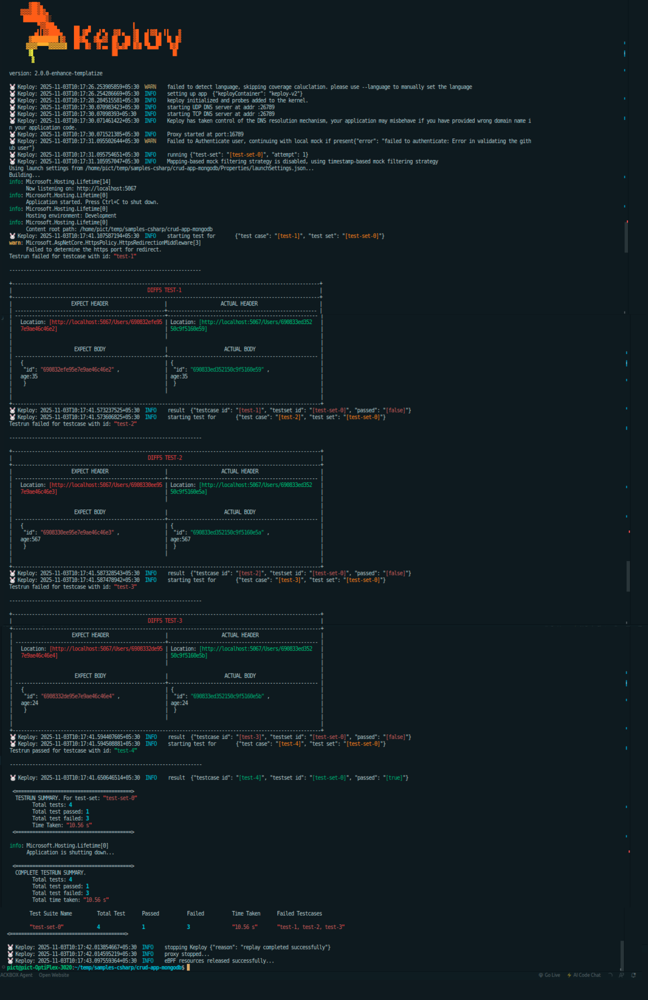

# Sample CRUD application

This is a sample C# application that demonstrates the usage of Keploy with .NET and MongoDB.

## Get Started with Keploy

1. **Install Keploy**
```bash
curl -L https://github.com/keploy/keploy/releases/latest/download/keploy_linux_amd64.tar.gz -o keploy.tar.gz
tar -xzf keploy.tar.gz
sudo mv keploy /usr/local/bin/
sudo chmod +x /usr/local/bin/keploy
rm keploy.tar.gz

# Verify installation
keploy version
```

2. **Setup application**
```bash
git clone https://github.com/keploy/samples-csharp.git
cd samples-csharp/crud-app-mongodb
```

## Prerequisites

### Install .NET 8 SDK and Runtime

```bash
# Download and install Microsoft repository configuration
wget https://packages.microsoft.com/config/ubuntu/20.04/packages-microsoft-prod.deb -O packages-microsoft-prod.deb
sudo dpkg -i packages-microsoft-prod.deb
rm packages-microsoft-prod.deb

# Update package lists
sudo apt-get update

# Install .NET 8 Runtime and SDK
sudo apt-get install -y dotnet-runtime-8.0 aspnetcore-runtime-8.0 dotnet-sdk-8.0

# Verify installation
dotnet --version
```

### Install and Start MongoDB

```bash
# Import MongoDB public GPG key
wget -qO - https://www.mongodb.org/static/pgp/server-7.0.asc | sudo apt-key add -

# Create list file for MongoDB
echo "deb [ arch=amd64,arm64 ] https://repo.mongodb.org/apt/ubuntu focal/mongodb-org/7.0 multiverse" | sudo tee /etc/apt/sources.list.d/mongodb-org-7.0.list

# Update package database
sudo apt-get update

# Install MongoDB
sudo apt-get install -y mongodb-org

# Start MongoDB
sudo systemctl start mongod

# Enable MongoDB to start on boot
sudo systemctl enable mongod

# Verify MongoDB is running
sudo systemctl status mongod
```

### Configuration

Update `appsettings.json` with your MongoDB connection string (default configuration works with local MongoDB):

```json
{
  "MongoDBSettings": {
    "ConnectionString": "mongodb://localhost:27017",
    "DatabaseName": "UserDb",
    "UsersCollectionName": "Users"
  }
}
```

## Running in Record Mode

```bash
sudo -E env "PATH=$PATH" keploy record -c "dotnet run" --proxy-port 8080 --path ./keploy-tests
```

**Note:** Keploy requires elevated permissions (sudo) to use eBPF for intercepting network calls.

Now, since we have our application up and running, let's perform a few cURL requests (in a new terminal):

### 1. POST Requests

```bash
curl -X POST -H "Content-Type: application/json" -d '{"name":"Sarthak Shnygle","age":23}' http://localhost:5067/api/users

curl -X POST -H "Content-Type: application/json" -d '{"name":"Gourav Kumar","age":22}' http://localhost:5067/api/users
```

### 2. GET Request

```bash
curl http://localhost:5067/api/users
```

### 3. GET Request by ID

```bash
# Replace {id} with actual ID from POST response
curl http://localhost:5067/api/users/{id}
```

### 4. DELETE Request

```bash
# Replace {id} with actual ID from POST response
curl -X DELETE http://localhost:5067/api/users/{id}
```

And voila, we have our test cases generated in the `./keploy-tests` directory!


### Stop Recording

Press `Ctrl+C` in the terminal where Keploy is running to stop recording.

## Run the Test Cases

Now let's run Keploy in test mode:

```bash
sudo -E env "PATH=$PATH" keploy test -c "dotnet run" --path ./keploy-tests --delay 10
```

The `--delay 10` flag gives the .NET application 10 seconds to start before running tests.

Keploy will replay all recorded test cases and generate a test report in the `keploy-tests/reports` directory.




## Troubleshooting

### Port Already in Use

If you get an "address already in use" error:

```bash
# Kill existing dotnet processes
pkill -9 dotnet
```

### MongoDB Not Running

Ensure MongoDB is running:

```bash
sudo systemctl status mongod

# If not running, start it
sudo systemctl start mongod
```

### Permission Denied

Always use `sudo -E env "PATH=$PATH"` with Keploy commands to preserve environment variables and provide necessary permissions for eBPF.

## API Endpoints

- `GET /api/users` - Get all users
- `POST /api/users` - Create a new user
- `GET /api/users/{id}` - Get user by ID
- `PUT /api/users/{id}` - Update user by ID
- `DELETE /api/users/{id}` - Delete user by ID

## Resources

- [Keploy Documentation](https://keploy.io/docs)
- [.NET 8 Documentation](https://learn.microsoft.com/en-us/dotnet/core/whats-new/dotnet-8)
- [MongoDB .NET Driver](https://www.mongodb.com/docs/drivers/csharp/)

# CRUD app using MongoDB

This repository contains a sample .NET 8 Web API that uses MongoDB for CRUD operations and integrates with [Keploy](https://keploy.io) to auto-generate and run test cases by recording real API traffic.

---

## 📦 Tech Stack

- [.NET 8 Web API](https://dotnet.microsoft.com/)
- [MongoDB](https://www.mongodb.com/)
- [Keploy](https://keploy.io) – API testing and mocking tool

---

## 🚀 Getting Started

### 1. Clone the Repository

```bash
git clone https://github.com/Pranav5255/samples-mongodb.git
cd samples-mongodb
```

### 2. Install Prerequisites

#### Install .NET 8 SDK and Runtime

```bash
# Download and install Microsoft repository configuration
wget https://packages.microsoft.com/config/ubuntu/20.04/packages-microsoft-prod.deb -O packages-microsoft-prod.deb
sudo dpkg -i packages-microsoft-prod.deb
rm packages-microsoft-prod.deb

# Update package lists
sudo apt-get update

# Install .NET 8 Runtime and SDK
sudo apt-get install -y dotnet-runtime-8.0 aspnetcore-runtime-8.0 dotnet-sdk-8.0

# Verify installation
dotnet --version
```

#### Install MongoDB

```bash
# Import MongoDB public GPG key
wget -qO - https://www.mongodb.org/static/pgp/server-7.0.asc | sudo apt-key add -

# Create list file for MongoDB
echo "deb [ arch=amd64,arm64 ] https://repo.mongodb.org/apt/ubuntu focal/mongodb-org/7.0 multiverse" | sudo tee /etc/apt/sources.list.d/mongodb-org-7.0.list

# Update package database
sudo apt-get update

# Install MongoDB
sudo apt-get install -y mongodb-org

# Start MongoDB
sudo systemctl start mongod

# Enable MongoDB to start on boot
sudo systemctl enable mongod

# Verify MongoDB is running
sudo systemctl status mongod
```

### 3. Configure MongoDB

Update `appsettings.json` with your MongoDB connection string:

```json
{
  "MongoDBSettings": {
    "ConnectionString": "mongodb://localhost:27017",
    "DatabaseName": "UserDb",
    "UsersCollectionName": "Users"
  }
}
```

### 4. Run the .NET App

```bash
dotnet run
```

App runs by default at:

```
http://localhost:5067
```

You can test endpoints like:

```http
GET    /users
POST   /users
GET    /users/{id}
PUT    /users/{id}
DELETE /users/{id}
```

#### Test with cURL

```bash
# Create a user
curl -X POST "http://localhost:5067/users" \
  -H "Content-Type: application/json" \
  -d '{"name":"Pranav","age":24}'

# Get all users
curl http://localhost:5067/users
```

---

## 🐾 Generate Test Cases with Keploy

### 1. Install Keploy

```bash
# Download Keploy binary
curl -L https://github.com/keploy/keploy/releases/latest/download/keploy_linux_amd64.tar.gz -o keploy.tar.gz

# Extract it
tar -xzf keploy.tar.gz

# Move to /usr/local/bin
sudo mv keploy /usr/local/bin/

# Make it executable
sudo chmod +x /usr/local/bin/keploy

# Clean up
rm keploy.tar.gz

# Verify installation
keploy version
```

### 2. Record API Calls

**Important:** Keploy requires elevated permissions to use eBPF for intercepting network calls. You must run it with `sudo`:

```bash
sudo -E env "PATH=$PATH" keploy record -c "dotnet run" --proxy-port 8080 --path ./keploy-tests
```

The application will start and Keploy will begin recording. Keep this terminal running.

### 3. Replay Tests
After Recording:
``` bash
keploy.exe test --path ./keploy-tests
```

### 3. Generate Traffic

Open a **new terminal** and send traffic to your application:

```bash
# Create a user
curl -X POST "http://localhost:5067/users" \
  -H "Content-Type: application/json" \
  -d '{"name":"John","age":30}'

# Get all users
curl http://localhost:5067/users

# Get user by ID (replace {id} with actual ID from response)
curl http://localhost:5067/users/{id}
```

Keploy will automatically capture these requests and responses as test cases in the `./keploy-tests` directory.

### 4. Stop Recording

Press `Ctrl+C` in the terminal where Keploy is running to stop recording.

### 5. Replay Tests

After recording, replay the captured test cases:

```bash
sudo -E env "PATH=$PATH" keploy test -c "dotnet run" --path ./keploy-tests --delay 10
```

The `--delay 10` flag gives the .NET application 10 seconds to start before running tests.

---

## 📝 Notes

- **Sudo Required**: Keploy uses eBPF (extended Berkeley Packet Filter) to intercept network traffic, which requires root privileges. Always run `keploy` commands with `sudo -E env "PATH=$PATH"` to preserve your environment variables.

- **Port Already in Use**: If you get an "address already in use" error, kill any existing dotnet processes:
  ```bash
  pkill -9 dotnet
  ```

- **MongoDB Connection**: Ensure MongoDB is running before starting the application:
  ```bash
  sudo systemctl status mongod
  ```

---

## 🔗 Resources

- [Keploy Documentation](https://keploy.io/docs)
- [.NET 8 Documentation](https://learn.microsoft.com/en-us/dotnet/core/whats-new/dotnet-8)
- [MongoDB .NET Driver](https://www.mongodb.com/docs/drivers/csharp/)

---

## 🤝 Contributing

Contributions are welcome! Please feel free to submit a Pull Request.

---

## 📄 License

This project is licensed under the MIT License.

